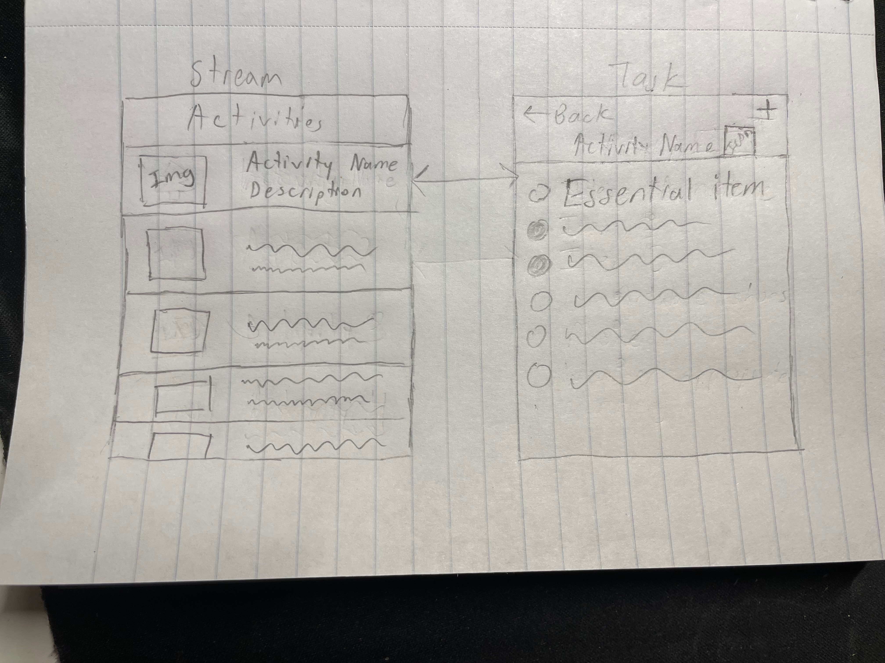

Original App Design Project - README Template
===

# theBasics

## Table of Contents

1. [Overview](#Overview)
2. [Product Spec](#Product-Spec)
3. [Wireframes](#Wireframes)
4. [Schema](#Schema)

## Overview

### Description

An app that helps users be prepared for trips. Users can track a list of essentials to bring, organize an itinerary, and customize their own activities with an essentials list.

### App Evaluation

- **Category:** Travel
- **Mobile:** You can see what to buy immediately from the app when shopping for essentials in stores. You can also plan trips which you can view during the trip to keep track of your itinerary (mobile is more transportable than a computer)
- **Story:** This app allows user to always be prepared for trips by having an accessible list of essentials for certain activities. Users also have an organized and accessible itinerary to always be on track with their trip.
- **Market:** Anyone who is taking a trip and wants to be prepared for it and plan the trip accordingly
- **Habit:** Users will regularly check the app when they need to remember what to pack/get for the trip. Users will also check the app often during trips to track the activities they wanted to do that day. Users can create a custom activity with a custom list of essentials they want to pack for it as well.
- **Scope:** V1 would include a list of activities with a list of essentials to bring for each one. V2 would allow users to add an essential to the list of essentials for a built in activity. V3 would include a tab where users can plan their itinerary by selecting the activities they want to do and ordering them. V4 would include an option for users to create new activities of their own to add with a list of their own essentials they want to bring.

## Product Spec

### 1. User Stories (Required and Optional)

**Required Must-have Stories**

* Users can view a list of activities
* Users can select an activity to view an essentials list for that activity
* Users can check off items on an activity's essential list

**Optional Nice-to-have Stories**

* Users can add a custom item to the essentials list
* Users can create a custom activity with it's own essential list
* Users can create an itinerary by selecting activities and ordering them

### 2. Screen Archetypes

- [ ] Stream
* Users can view a list of built in activities
- [ ] Task
* Users can select an activity to view an essentials list for that activity and check off items on an activity's essential list

### 3. Navigation

**Flow Navigation** (Screen to Screen)

- [ ] Stream
* Navigate to task screen
- [ ] Task
* Go back to stream screen

## Wireframes

### [BONUS] Digital Wireframes & Mockups

### [BONUS] Interactive Prototype

## Schema 

    
    
  

  
Completed Features
- [x] Users can view a list of activities
- [x] Users can select an activity to view an essentials list for that activity
- [x] Users can check off items on an activity's essential list
- [x] Items that are checked off are saved  

### Models

[Add table of models]

### Networking

- [Add list of network requests by screen ]
- [Create basic snippets for each Parse network request]
- [OPTIONAL: List endpoints if using existing API such as Yelp]
